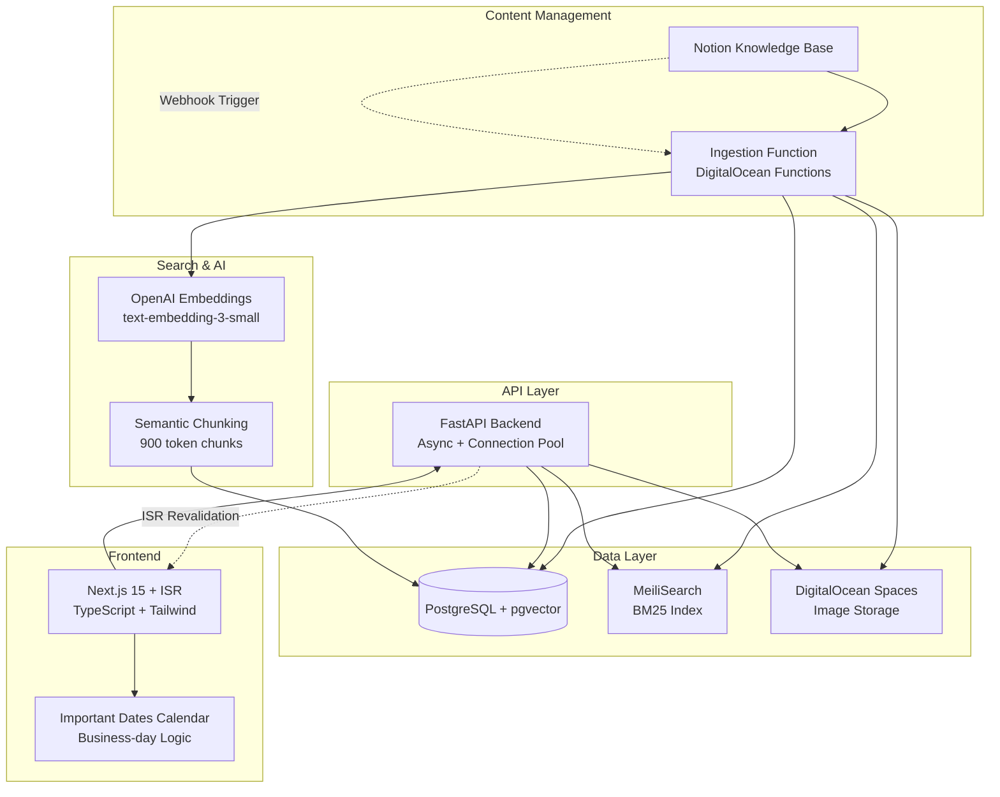

# Toku Customer Help Center - AI Engineering Guide

**A production-ready hybrid search knowledge base with Notion CMS integration, vector embeddings, ISR-powered frontend, contractor payment calendar, and AI-assisted employer cost calculator.**

## 🏗️ Architecture Overview



## 🧠 AI/ML Features

### 1. Hybrid Search Engine
- **BM25 (MeiliSearch)**: Keyword/lexical search with auto-complete
- **Vector Search (pgvector)**: Semantic similarity using OpenAI embeddings
- **Smart Snippet Generation**: Context-aware excerpt creation

## 🔒 Security

**Production-ready security implementation with comprehensive protections:**

- ✅ **No Console Logging**: All debug logs removed to prevent information leakage
- ✅ **Secrets Management**: Environment variables only, no hardcoded keys
- ✅ **AI Guardrails**: Input validation, prompt injection protection, scope limitation
- ✅ **SQL Injection Protection**: Parameterized queries throughout
- ✅ **Input Validation**: Length limits, format validation, XSS filtering
- ✅ **Error Handling**: Generic responses, no sensitive data exposure

*See `SECURITY_AUDIT_RESULTS.md` for detailed security audit report.*
- **Related Articles**: Cosine similarity on averaged document embeddings

### 2. Intelligent Content Processing
- **Automatic Categorization**: Title-based classification (Library, Payroll, Benefits, Policy)
- **Type Inference**: Pattern matching for how-to, guide, policy, FAQ, process, info
- **Persona Targeting**: Admin, Employee, Contractor, Partner, General
- **Tag Extraction**: Keyword-based automatic tagging
- **Smart Summarization**: Purpose statement extraction + fallback algorithms

### 3. Semantic Chunking
```python
class ChunkingService:
    max_tokens: int = 900  # Optimized for text-embedding-3-small
    
    def to_chunks(self, markdown: str) -> List[Dict]:
        # Header-aware chunking with hierarchy preservation
        # Token-based splitting with semantic boundaries
        # Heading path maintenance for context
```

### 4. AI-Assisted Employer Cost Calculator
- **Deterministic Math Engine**: Precise calculations for employer costs across 5+ countries
- **Real-time Cost Breakdown**: Employee deductions, employer contributions, tax estimates
- **AI-Powered Summaries**: GPT-4 generates client-ready emails with explanations
- **Multi-Currency Support**: EUR, USD, GBP, HUF, INR with proper formatting
- **Smart Disclaimers**: Context-aware caveats about estimates and variations

**Key Features:**
- Side-by-side employee/employer cost comparison
- Effective employer burden percentage calculation
- One-click email generation for client communication
- Responsive UI with loading states and error handling

## 🚀 Tech Stack Deep Dive

### Backend: FastAPI + Async PostgreSQL
```python
# Core architecture
FastAPI(lifespan=async_lifespan)  # Async context management
+ asyncpg.create_pool()           # Connection pooling
+ pydantic v2                     # Type safety & validation
+ pgvector                        # Vector similarity search
+ MeiliSearch                     # Full-text search
```

**Key Services:**
- `NotionService`: Async Notion API client with image processing
- `ChunkingService`: Semantic text chunking with tiktoken
- `EmbeddingsService`: Batch OpenAI embedding generation
- `IndexerService`: Dual indexing (PostgreSQL + MeiliSearch)

### Frontend: Next.js 15 + Advanced Patterns
```typescript
// ISR + Dynamic routing
export const revalidate = false;    // Per-route ISR control
export const dynamicParams = true;  // Dynamic slug handling

// Client-side search with autocomplete
useCallback + debouncing + keyboard navigation
+ real-time suggestions + smart filtering
```

**Key Features:**
- **ISR (Incremental Static Regeneration)**: Article pages cached, revalidated on content updates
- **Progressive Enhancement**: Search works without JavaScript
- **TypeScript**: Strict typing throughout
- **Tailwind CSS v4**: CSS-based configuration
- **Important Dates Calendar**: Business-day aware payment schedule with ICS export
- **Employer Cost Calculator**: AI-powered tool for calculating total employment costs across countries

### Database Schema (PostgreSQL + pgvector)
```sql
-- Core tables
articles: UUID PK, vector-optimized metadata
chunks: 1536-dim embeddings, hierarchical paths
search_feedback: User interaction tracking
article_views: Analytics with IP/UA tracking

-- Indexes
ivfflat vector index for O(log n) similarity search
B-tree indexes on slug, category, updated_at
```

## 🔄 Content Ingestion Pipeline

### Notion → Knowledge Base Flow
```python
async def sync_notion_content():
    1. Fetch index page structure (parallel block fetching)
    2. Category inference from heading hierarchy
    3. Fresh URL generation for images (bypass expiry)
    4. Markdown conversion with image processing
    5. Semantic chunking (900 tokens, header-aware)
    6. Batch embedding generation (OpenAI API)
    7. Dual indexing (PostgreSQL + MeiliSearch)
    8. ISR trigger for updated articles
```

**Image Processing Pipeline:**
- Notion images → DigitalOcean Spaces (permanent storage)
- CDN optimization + expiry handling
- Fallback to fresh Notion URLs

**Parallel Processing:**
- Batch size: 3 concurrent page processing
- Async embedding generation (100 texts/batch)
- Connection pooling for database operations

## 🔍 Search Implementation

### Multi-Modal Search Strategy
```python
# 1. MeiliSearch (BM25) for keyword matching
search_params = {
    'limit': top_k * 3,  # Over-fetch for snippet generation
    'attributesToHighlight': ['title', 'summary', 'content_md'],
    'filter': 'category = "Benefits" AND type = "how-to"'
}

# 2. PostgreSQL (pgvector) for semantic search
WITH article_embeddings AS (
    SELECT article_id, AVG(embedding) as avg_embedding
    FROM chunks GROUP BY article_id
)
SELECT *, 1 - (embedding <=> query_embedding) as similarity
```

### Smart Autocomplete
- **Title matching**: Direct article suggestions
- **Category filtering**: Dynamic category suggestions  
- **Phrase completion**: Common search patterns
- **Debounced requests**: 300ms delay, loading states

## 📅 Important Dates Calendar

### Business-Day Aware Payment Scheduling
The help center includes a contractor payment calendar that automatically calculates important dates based on business rules:

```typescript
// Business Rules Implementation
- Invoice Due: 20th of month (→ previous business day if weekend)
- Pre-funding Sent: 2 business days after invoice approval
- Pre-funding Due: 3 calendar days before payment (→ previous business day if weekend)  
- Contractor Payment: Last business day of month
```

**Key Features:**
- **Business Day Logic**: Automatically shifts weekend dates to previous business day
- **Visual Timeline**: Color-coded events (red: invoice, blue: pre-funding sent, orange: pre-funding due, green: payment)
- **ICS Export**: One-click calendar download for monthly schedules
- **Responsive Design**: Mobile-optimized calendar grid with Toku branding

**Technical Implementation:**
```typescript
// libs/business-days.ts - Core date calculations
export const addBusinessDays = (date: Date, days: number) => {
  // Skips weekends when adding days
}

// libs/contractor-dates.ts - Event generation
export function buildContractorEvents(year: number, month: number) {
  // Generates all payment events for a given month
}

// components/ImportantDatesCalendar.tsx - UI Component
// Renders interactive calendar with month navigation
```

## 📊 Analytics & Feedback

### User Interaction Tracking
```sql
-- View tracking (privacy-conscious)
article_views: article_id, ip_address, user_agent, timestamp

-- Feedback collection
search_feedback: article_id, helpful (boolean), notes, timestamp
```

## 🚪 Main Features & Access

The Help Center provides several key features accessible through the navigation:

- **Home** (`/`): Browse categories and popular articles
- **Search** (`/search`): Full-text and semantic search across all content
- **Calendar** (`/calendar`): Interactive payment schedule with business day calculations
- **Cost Calculator** (`/calculators/employer-cost`): AI-powered employer cost calculations for multiple countries
- **Articles** (`/a/[slug]`): Individual help articles with related content suggestions

### Performance Monitoring
- API response times via FastAPI middleware
- Search result relevance via user feedback
- Popular articles by view count
- ISR cache hit rates

## 🚢 Production Deployment (DigitalOcean)

### App Platform Configuration
```yaml
services:
  web:    # Next.js (ISR enabled)
    build_command: npm install && npm run build
    run_command: npm start
    instance_size: basic-xs
    
  api:    # FastAPI (Uvicorn)
    dockerfile_path: /apps/api/Dockerfile
    instance_size: basic-xs
    
databases:
  - engine: PG
    version: "17"
    production: true
```

### Environment Variables
```bash
# Backend
DATABASE_URL=postgresql://...          # PostgreSQL connection
MEILI_HOST=http://10.124.0.39:7700    # Internal MeiliSearch
OPENAI_API_KEY=sk-...                 # OpenAI embeddings
NOTION_TOKEN=secret_...               # Notion integration
SPACES_*=...                          # DigitalOcean Spaces

# Frontend  
NEXT_PUBLIC_API_URL=${APP_URL}/api    # API endpoint
REVALIDATE_TOKEN=...                  # ISR security
```

### Scalability Considerations
- **Database**: Connection pooling (5-10 connections)
- **API**: Horizontal scaling via App Platform
- **Search**: MeiliSearch in-memory index
- **CDN**: DigitalOcean Spaces for static assets
- **Caching**: ISR for article pages, API response caching

## 🛠️ Development Workflow

### Local Setup
```bash
# Backend
cd apps/api
python -m venv venv && source venv/bin/activate
pip install -r requirements.txt
uvicorn main:app --reload --port 8080

# Frontend  
cd apps/web
npm install && npm run dev

# MeiliSearch
docker run -p 7700:7700 getmeili/meilisearch:v1.5

# PostgreSQL + pgvector
createdb help_center
psql help_center < apps/api/db/schema.sql
```

### Content Ingestion (Manual)
```bash
cd functions/ingestion
python handler.py  # Full sync from Notion
```

## 🔧 AI Engineering Customization

### Embedding Model Swapping
```python
# apps/api/services/embeddings.py
class EmbeddingsService:
    def __init__(self):
        # Switch providers: "openai" | "local" 
        if settings.embeddings_provider == "openai":
            self.model = "text-embedding-3-small"  # 1536 dims
        # Add custom model implementations here
```

### Search Algorithm Tuning
```python
# MeiliSearch configuration
'searchableAttributes': ['title', 'summary', 'content_md', 'headings', 'tags'],
'filterableAttributes': ['type', 'category', 'persona'],
'sortableAttributes': ['updated_at', 'reading_time_min']

# pgvector similarity tuning
ORDER BY 1 - (embedding <=> query_embedding) DESC  # Cosine similarity
```

### Content Processing Pipeline
```python
# apps/api/services/indexers.py
def _infer_type(self, title: str) -> str:
    # Customize classification logic
    if re.search(r'how\s+to', title.lower()):
        return 'how-to'
    # Add custom patterns here

def _generate_summary(self, content: str) -> str:
    # Customize summarization algorithm
    # Current: Purpose statement extraction + truncation
    # Potential: LLM-based summarization
```

## 📈 Performance Benchmarks

### Search Latency
- **BM25 Search**: ~50ms (MeiliSearch)
- **Vector Search**: ~100ms (PostgreSQL + pgvector) 
- **Hybrid Results**: ~150ms (sequential)
- **Autocomplete**: ~30ms (cached suggestions)

### Ingestion Throughput
- **Page Processing**: ~2-3 seconds/page (with images)
- **Embedding Generation**: ~100 texts/batch (OpenAI rate limits)
- **Parallel Processing**: 3 concurrent pages

### Storage Efficiency
- **Vector Storage**: 1536 dimensions × 4 bytes = ~6KB per chunk
- **Text Chunks**: ~900 tokens avg = ~3KB text
- **Images**: Compressed + CDN optimized

## 🔐 Security & Privacy

### Content Security
- **ISR Revalidation**: Token-based authentication
- **API Access**: CORS configuration
- **Database**: Connection pooling with credentials

### User Privacy
- **Analytics**: IP addresses stored but not linked to personal data
- **Feedback**: Anonymous unless explicitly provided
- **Search**: No query logging in production

## 🚦 Monitoring & Observability

### Health Checks
```python
@app.get("/healthz")
async def health_check():
    return {"ok": True}  # Add DB/search connectivity checks
```

### Key Metrics to Monitor
- Search success rate (clicks after search)
- Article view durations
- Feedback sentiment distribution
- ISR cache efficiency
- API response times

---

## 🎯 AI Engineering Next Steps

1. **Enhanced Embeddings**: Experiment with newer models (text-embedding-3-large)
2. **RAG Implementation**: Add conversational search with context
3. **Auto-Classification**: Train custom models on content patterns
4. **Search Analytics**: ML-powered query understanding
5. **Content Generation**: Automated summary improvements
6. **Multi-language**: Embeddings for internationalization
7. **Calendar Enhancements**: 
   - Holiday awareness for different countries
   - Admin overrides for specific dates
   - Payment instruction CTAs on due dates
   - Multi-timezone support for global teams

8. **Development Verification**: Repository access, linting, and PR workflow have been verified and are functioning correctly.

**Built for production scale, optimized for AI workflows, designed for extensibility.**
